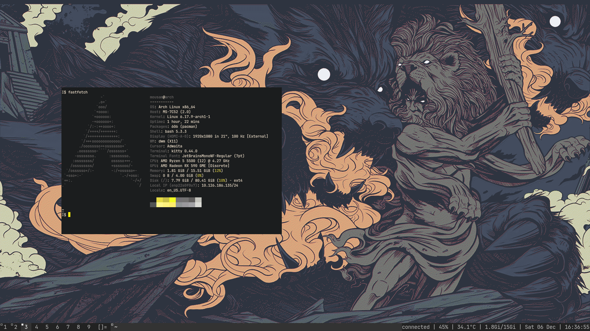

# Dependencies 

# ARCH DUAL BOOT LOADER 

* pulseaudio (pactl)
* Network mgr (nmcli)
* efibootmgr   
* os-prober   

# SUCKLESS DEPENDENCIES

* base-devel/gdb
* libx11 
* linxft
* libxinerama
* sudo pacman -S xorg-xsetroot (dwm status bar)
* ttf-dejavu    

# FONTS

* yay -Ss nerd-fonts 		search for available nerd font 
* sudo pacman -S ttf-jetbrains-mono-nerd 
> change dwm | dmenu | st > JetBrainsMono Nerd Font
* sudo fc-cache -fv

* https://git.suckless.org/dwm
* https://git.suckless.org/dmenu
* https://git.suckless.org/st
* pacman -S kitty

# PACKAGE MANAGE

* sudo pacman -Syu
* git clone https://aur.archlinux.org/yay.git > cd yay > makepkg -si 

# SYSTEM DEPENDENCIES

* git/openssh/less/tree
* man-db/tldr
* stow    		:symlinking to ~
* wget    		:download stuff from internet
* feh     		:wallpaper daemon
* gvim/vim     		:code editor
* xorg-xrandr   	:monitor refresh rate 
* libnotify,dunst 	:notification
* yazi/nnn 		:file mgr
* ffmpeg 		:video audio
* mpv 			:vieo player 
* sxiv			:img viewer
* fzf
* sudo pacman -S ueberzug
* xclip 		:copy to sys clip board 
* tmux 
* fastfetch
* ntfs-3g 		:mount windows part to linux

# to install

* ngrok			tunneling ports
* tmux
* croc			share file no ssh
* picom 		:compositer transparency
* zathura 		:pdf viewer

# APPLICATION

* pacman -S qutebrowser
* firefox 
> * u-block 
> * unhook 
> * settings > ext and themes > set theme 
> * Open previous windows and tabs
> * only websearch & shortcut on HOME
* GIMP:img editing
* darktable:img
* kadenlive:
